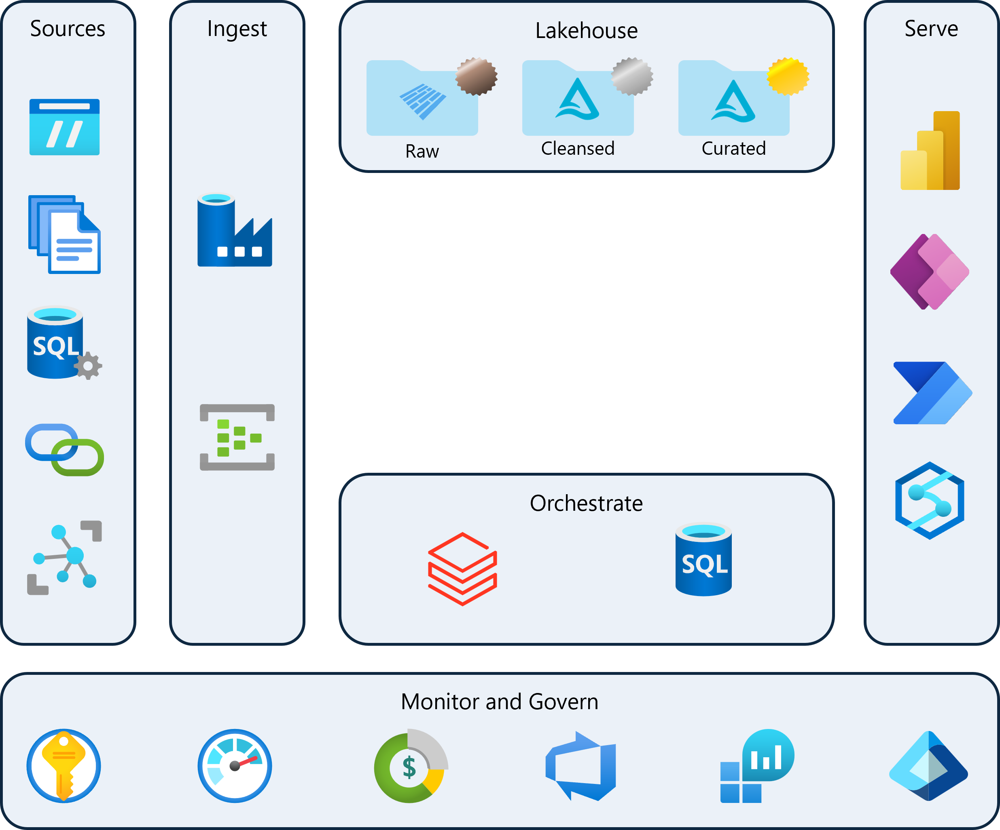

## Overview
This template deploys the services that are used in the **Cost Effective Data Platform on Azure**. 

Deploys core services including:
    - Key Vault, Storage, Data Factory, Databricks, Function Apps, SQL Server
    - Configures role assignments and dependencies between services

This reference architecture is designed to provide individuals with a path to quickly build a data platform in Azure. More information about this architecture can be found at, [LINK TEXT](https://link.url).

This template will deploy the following resources:
- **Azure Data Factory**: a fully managed, scalable, and serverless data integration service. It provides a data integration and transformation layer that works with various data stores.
- **Azure Data Lake Storage Gen2**: is a scalable and secure data lake for high-performance analytics workloads. You can use Data Lake Storage to manage petabytes of data with high throughput. It can accommodate multiple, heterogeneous sources and data that's in structured, semi-structured, or unstructured formats.
- **Azure Databricks**: a data analytics platform that uses Spark clusters. The clusters are optimized for the Azure platform.
- **Azure SQL Database**: a fully managed platform as a service (PaaS) database engine that handles most of the database management functions like upgrading, patching, backups, and monitoring without user involvement. SQL Database is always running on the latest stable version of the SQL Server database engine and patched OS with high availability.
- **Azure Key Vault**: a cloud service for securely storing and accessing secrets.

These additional resources are optional:
- **Azure Event Hub**: a big-data streaming platform and event ingestion service. It can receive and process millions of events per second. Data sent to an event hub can be transformed and stored by using any real-time analytics provider or batching/storage adapters.

In addition to these services, the template will set up the necessary permissions for each of the resources to communicate with each other. The template will also create Azure Data Factory Linked Services for each resource.

## Architecture

## Prerequisites

- An Azure subscription.
- Permissions to create a resource group
